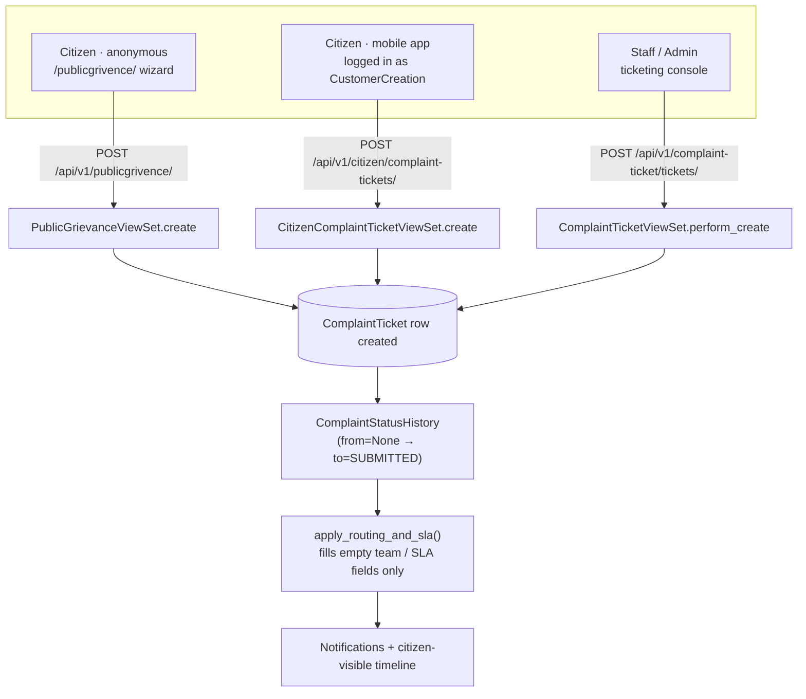
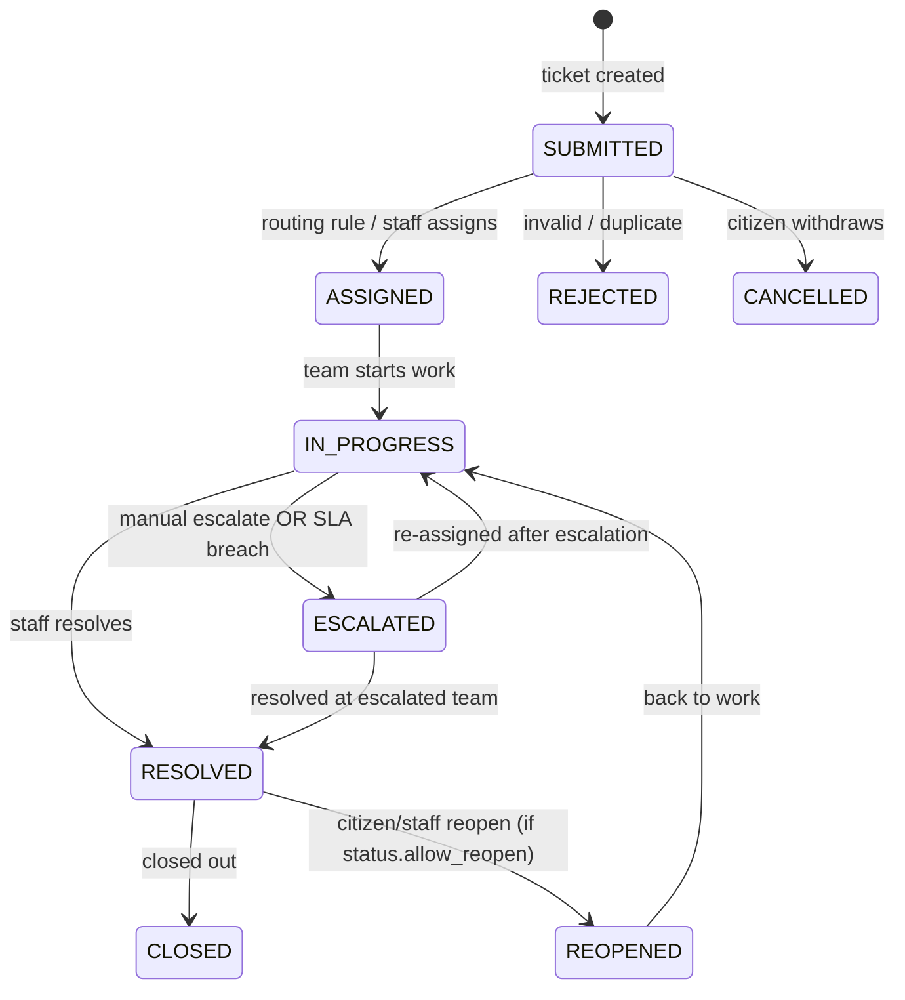
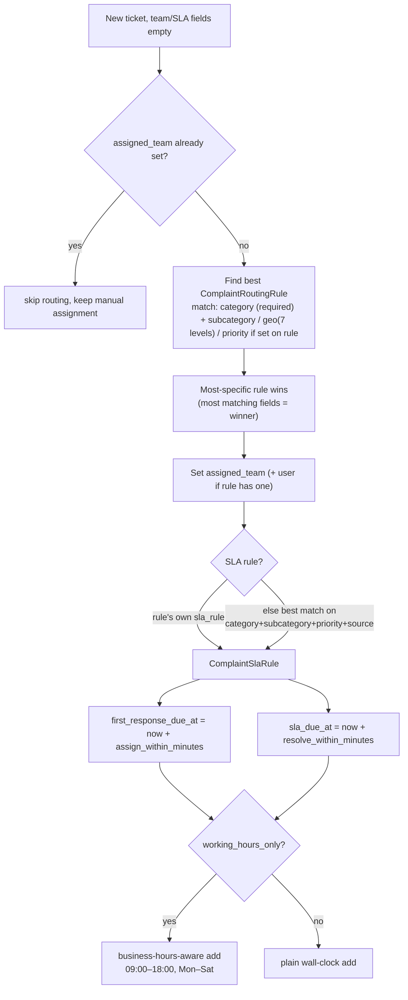

# Complaint Ticketing & Public Grievance — Flow Reference

**IWMS Government Webapp · Systems Reference**

How a complaint enters the system (from a citizen, the mobile app, or staff), how it gets routed, tracked, escalated and closed — and every model, endpoint and screen involved along the way.

- **Backend** — Django REST · `app/models/complaint_ticket/`
- **Frontend** — React/TS · `src/features/complaintTicketing/`
- **Scope** — intake → routing → SLA → escalation → resolution → citizen tracking

## Contents

1. [Who's involved](#1-whos-involved)
2. [What is what](#2-what-is-what)
3. [How a ticket is created](#3-how-a-ticket-is-created)
4. [Ticket lifecycle](#4-ticket-lifecycle)
5. [Routing & SLA engine](#5-routing--sla-engine)
6. [Escalation & SLA breach detection](#6-escalation--sla-breach-detection)
7. [Citizen tracking](#7-citizen-tracking--no-login-required)
8. [API map](#8-api-map)
9. [Notable gaps & loose ends](#9-notable-gaps--loose-ends)

---

## 1. Who's involved

Every complaint — however it arrives — becomes one row in `ComplaintTicket`. What differs per channel is authentication, what fields are trusted, and how much of the workflow the user can see.

| Actor | Channel | Notes | Route / API |
|---|---|---|---|
| **Anonymous citizen** | Public Grievance | No login. 4-step wizard: details → GPS location → complaint type → review/submit. Also where "track my complaint" lives. | `/publicgrivence/*` · `/api/v1/publicgrivence/` |
| **Authenticated citizen** | Mobile app | A known `CustomerCreation` record raises a ticket from the app. Geo is inherited from the customer profile, not GPS. | `/api/v1/citizen/complaint-tickets/` |
| **Staff / admin** | Ticketing console | Logged-in staff triage, assign, escalate, resolve and comment on tickets, scoped to their geography, team or department. | `/admin/.../complaintTicketing` · `/api/v1/complaint-ticket/` |
| **Leadership** | Dashboards | Read-only KPI views for staff (`Grievances.tsx`, home-page widget) and a state-level view — the latter currently on mock data. | `/dashboard/*`, `/state/dashboard` |

---

## 2. What is what

The complaint domain splits into three families: the **ticket itself**, **configuration masters** that shape how it's routed and timed, and an **audit trail** written on every state change.

### 2.1 The ticket

| Model | Holds | Key relationships |
|---|---|---|
| `ComplaintTicket` | The complaint: title, description, citizen contact, GPS/geo, category/priority/status, assigned team/staff, SLA due dates, sensitivity flag. | One row is the source of truth; almost everything else FKs to it. |
| `ComplaintTicketExtraDetail` | Free-form key/value pairs for category-specific fields that don't warrant their own column. | Many-to-one on ticket. |
| `ComplaintAttachment` | Uploaded files — first one is treated as the "complaint photo", most recent as the "resolution photo" once ≥2 exist. | Many-to-one on ticket; uploader is either a customer or a staff user. |
| `ComplaintComment` | Notes on a ticket — `is_internal` hides staff-only remarks from the citizen-facing timeline. | Many-to-one on ticket. |
| `ComplaintFeedback` | Citizen satisfaction rating + free text, one per ticket. | One-to-one on ticket. |
| `ComplaintAddressChangeRequest` | A "my address is wrong" ticket sub-type: old/new address snapshot, proof document, verify → approve/reject. | One-to-one on ticket; on approval, overwrites the citizen's `CustomerCreation` address in place. |

### 2.2 Configuration masters (admin-editable, drive automation)

| Model | Purpose |
|---|---|
| `ComplaintModule` / `Category` / `Subcategory` | What the complaint is about (e.g. Missed Pickup, Bin Overflow). Category carries a `default_priority`, `default_team`, and flags for whether location/media/address-detail are required. |
| `ComplaintPriority` | P1 Emergency → P4 Info, ordered by `sort_order`. |
| `ComplaintStatus` | Lifecycle states, each with `is_final` and `allow_reopen` flags — the state machine is data-driven, not hardcoded. |
| `ComplaintSource` | Where it came from: Web, WhatsApp, Mobile App, Call Center, Admin, Public Grievance. |
| `ComplaintTeam` | Who resolves it — has a lead staff member, a department, an `escalates_to` parent team, and an `escalation_level`. |
| `ComplaintRoutingRule` | "If category X (+ optional subcategory/geo/priority), send to team Y" — most-specific rule wins. |
| `ComplaintSlaRule` | "If category X (+ optional subcategory/priority/source), respond within N minutes, resolve within M minutes, escalate after E minutes" — optionally business-hours-aware. |

### 2.3 Audit trail — one row written per state change

| Model | Written when |
|---|---|
| `ComplaintStatusHistory` | Every status transition — carries `visible_to_citizen`, which is exactly what powers the public tracking timeline. |
| `ComplaintAssignmentHistory` | Every assign/reassign — from/to team, staff, user, and who did it. |
| `ComplaintEscalationHistory` | Every escalation — level reached, from/to team, and whether it was system- or human-triggered. |
| `ComplaintReopenHistory` | Every reopen — previous status and reason. |
| `ComplaintNotification` | In-app notices to staff/users on assign, escalate, resolve, reopen. |

---

## 3. How a ticket is created

All three entry points converge on the same `ComplaintTicket` table and the same routing/SLA engine, but each fills the record differently.



Whichever door a complaint comes through, it lands in the same place and goes through the same routing step.

### 3.1 Public Grievance wizard (the anonymous flow)

1. **Your details** — name, gender; mobile and email are opt-in toggles, never OTP-verified.
   Client validation only: name + gender required; phone/email required *only if* their share-toggle is on.
2. **Location** — browser asks for GPS on entry to this step; a Leaflet map lets the citizen drag the pin.
   GPS accuracy > 500m shows an "approximate location" warning and skips auto-filled address; state → district → city dropdowns are optional extras, not required. Reverse-geocoding calls OpenStreetMap Nominatim *directly from the browser*, not via the Django backend.
3. **Complaint type & details** — category (required), subcategory (required only if the category has any), description (required, 1000 chars), optional photo.
4. **Review & submit** — read-only recap with per-section edit links, then `POST`s a `multipart/form-data` body including a `device_id` persisted in `localStorage`.

> **Server-side, on submit:** The backend resolves category (falls back to an `OTHER` category, then the first active one), priority (from selected waste type → subcategory → category → hardcoded `P3`), and team — all before the shared routing engine ever runs. If several waste types are selected on one ticket, the *most urgent* priority and the *strictest* SLA among them wins, since a ticket can only carry one priority/team.

### 3.2 Mobile app (authenticated citizen)

Simpler: category is required, everything else about the citizen (phone, name, full geo hierarchy) is copied straight from their `CustomerCreation` profile rather than re-entered. Source defaults to `MOBILE_APP`, status to `SUBMITTED`.

### 3.3 Staff / admin manual entry

A 3-step form (Citizen → Complaint → Location) for logging a complaint received by phone, walk-in, or on a citizen's behalf — picking an existing customer auto-fills their contact and geo. No dedup/idempotency check here; that's specific to the public form.

---

## 4. Ticket lifecycle

Statuses are data (`ComplaintStatus` rows with `is_final`/`allow_reopen` flags), not a hardcoded enum — but in practice the console and Kanban board exercise this exact path:



**Status → filter bucket (list screen).** The console's status filter groups raw codes into buckets:

- `pending` = SUBMITTED, ASSIGNED
- `started` = IN_PROGRESS
- `escalated` = ESCALATED
- `resolved` = RESOLVED, CLOSED, REJECTED, CANCELLED

**Every transition writes history.** Each status change appends a `ComplaintStatusHistory` row with `changed_by_system` or `changed_by_user`, and a `visible_to_citizen` flag — that flag is the entire mechanism gating what appears on the public tracker.

---

## 5. Routing & SLA engine

One shared function, `apply_routing_and_sla()`, runs after every ticket creation. It only ever fills *empty* fields — a manual assignment or due date is never overwritten.



> **Specificity tie-break:** Both routing and SLA rules can leave any match field blank to mean "any". When several rules match a ticket, the one with the *most populated match fields* wins — a rule scoped to one panchayat beats a state-wide rule for the same category.

---

## 6. Escalation & SLA breach detection

There's no Celery/task queue in this project — SLA breach detection is a Django management command meant to be run on a schedule (e.g. cron every 5 minutes): `python manage.py detect_sla_breaches`.

```mermaid
sequenceDiagram
    participant Cron as OS cron / systemd timer
    participant Cmd as detect_sla_breaches
    participant T as ComplaintTicket
    participant Esc as perform_escalation()
    participant Notif as notification_service

    Cron->>Cmd: run every N minutes
    Cmd->>T: find sla_due_at < now, sla_breached=False,
status not in {RESOLVED, CLOSED, REJECTED, CANCELLED}
    loop each overdue ticket
        Cmd->>T: sla_breached = True, sla_breached_at = now
        Cmd->>T: add internal comment "SLA breached — due {time}"
        Cmd->>Cmd: overdue_minutes >= sla_rule.escalation_after_minutes ?
        alt yes
            Cmd->>Esc: perform_escalation(ticket, target=sla_rule.escalation_team, by_system=True)
            Esc->>T: reassign team, status → ESCALATED
            Esc->>Notif: notify new lead (ESCALATED_TO) + old assignee (ESCALATED)
        end
    end
```

The same `perform_escalation()` routine backs the staff console's manual **Escalate** button — `escalation_level` increments each time (seeded from the current team's own level if it's the first escalation), and a ticket at the top of its team's escalation chain returns an error rather than looping.

---

## 7. Citizen tracking — no login required

Lives inline on the `/publicgrivence` landing page (not a separate route) — a segmented "by ticket number / by mobile number" search, no OTP, no captcha.

```mermaid
sequenceDiagram
    participant U as Citizen (browser)
    participant API as GET /api/v1/publicgrivence/status/
    participant T as ComplaintTicket
    participant H as ComplaintStatusHistory

    U->>API: ?ticket_no=IWMS-000123  (or ?mobile=...)
    API->>T: lookup ticket(s)
    API->>H: fetch status_history where visible_to_citizen=True
    API-->>U: ticket_no, status, category, description,
location, created, timeline[]
    Note over U: 4-stage tracker:
Submitted → Assigned → In Progress → Resolved
```

Internal-only history rows (e.g. an SLA-breach system comment, or staff-only remarks) simply never carry `visible_to_citizen=True`, so they're invisible to this endpoint by construction — there's no separate filtering logic to get wrong.

---

## 8. API map

All mounted under `/api/v1/{group}/{prefix}/`, except the public group which drops its prefix.

### 8.1 Public — anonymous, `AllowAny`

| Method | Path | Description |
|---|---|---|
| GET | `/publicgrivence/meta/` | waste types, categories, subcategories for the form pickers |
| GET | `/publicgrivence/states/` · `districts/?state=` · `cities/?district=` | cascading geo picker |
| POST | `/publicgrivence/` | submit grievance (multipart) → returns ticket_no |
| GET | `/publicgrivence/status/?ticket_no=` or `?mobile=` | track status — the citizen tracker |

### 8.2 Citizen — `IsAuthenticated`, scoped to own `CustomerCreation`

| Method | Path | Description |
|---|---|---|
| GET | `/citizen/complaint-tickets/` | list own tickets (Q: customer=self OR wa_phone=self) |
| POST | `/citizen/complaint-tickets/` | raise a ticket from the mobile app |
| GET | `/citizen/complaint-tickets/meta/` | active categories/subcategories/priorities |

### 8.3 Staff / admin — behind login, geo/team-scoped

| Method | Path | Description |
|---|---|---|
| GET | `/complaint-ticket/tickets/` | list — scoped by role: superuser/`?all=1` sees all; admin/supervisor sees their geo subtree; staff sees only their own assignments |
| PATCH | `/complaint-ticket/tickets/{id}/status/` | `{status_code, remarks}` |
| POST | `/complaint-ticket/tickets/{id}/assign/` | `{team, staff, reason}` |
| GET | `/complaint-ticket/tickets/{id}/assignable-staff/` | `?district=&city=&department=` picker for the Assign dialog |
| POST | `/complaint-ticket/tickets/{id}/resolve/` | `{resolution_note}` |
| POST | `/complaint-ticket/tickets/{id}/escalate/` | `{team?, reason}` — falls back to `escalates_to` |
| POST | `/complaint-ticket/tickets/{id}/reopen/` | `{reopen_reason}` — 400 if `status.allow_reopen` is false |
| POST | `/complaint-ticket/tickets/{id}/comments/` · `/attachments/` · `/feedback/` | notes, files, post-resolution rating |
| GET | `/complaint-ticket/{modules,categories,subcategories,priorities,statuses,sources,languages,teams,sla-rules,routing-rules}/` | configuration masters (CRUD, soft-delete) |
| GET | `/complaint-ticket/notifications/` · `/unread-count/` · POST `{id}/read/` · `mark-all-read/` | in-app alerts, scoped to the logged-in staff/user |
| POST | `/complaint-ticket/address-change/{id}/verify` · `approve` · `reject` | address-change sub-workflow |

---

## 9. Notable gaps & loose ends

Things that are true in the code today, not hypothetical risks — worth knowing before building on top of them.

- **Public-form duplicate check is disabled.** A `device_id`-keyed `idempotency_key` is stored on every public grievance, and a 6-hour cooldown constant (`PUBLIC_GRIEVANCE_DUPLICATE_WINDOW`) still exists in code — but its enforcement is commented out. The frontend still handles a 409 response as "already submitted", but the backend won't currently produce one. A comment in the code states this was deliberate, so citizens can register multiple complaints from one device.
- **No CAPTCHA or OTP anywhere in public intake.** Mobile number and email on the public form are voluntary, unverified contact fields — not a login or identity check. The only anti-abuse control is the (currently disabled) device-id cooldown above.
- **State-level dashboard is mock data.** `StateGrievanceDashboard.tsx` derives every number from a hardcoded sample-district dataset with arbitrary formulas (e.g. `overdue = pending × 0.35`), not from any live API. The component's own code comments flag it as a placeholder "until connected to the live grievance-redressal feed" — treat its figures as illustrative only.
- **Address-change approval has no history.** Approving an address-change request overwrites the citizen's `CustomerCreation` record in place. Only a single JSON snapshot of the *previous* address is kept on the request row — there's no append-only address-history table if a citizen changes address more than once.
- **Staff identity vs. user identity.** Staff authenticate as `StaffcreationOfficeDetails` records, not Django `User` objects. History rows have separate `*_by_user` and `*_by_staff`/`to_staff` columns for this reason — a staff-performed action leaves `changed_by_user` null and flows through the staff-specific field instead. Worth remembering when querying "who did this" across history tables.
