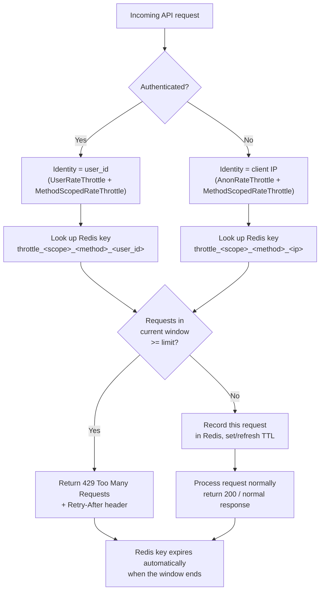

# API Rate Limiting (Redis)

## What this is

Every API endpoint in this project is rate-limited using Django REST
Framework's built-in throttling, backed by Redis as the counter store. No
Celery, no Nginx, no custom middleware — just DRF throttle classes + a Redis
cache backend.

When a client (a user or an anonymous caller) exceeds the allowed number of
requests in a time window, the API returns **HTTP 429 Too Many Requests**
until the window resets.

## Why Redis (and not the database or in-memory cache)

Before this change, `CACHES["default"]` was `LocMemCache` — an in-process
Python dict. That's a problem for rate limiting specifically because:

- Gunicorn runs **3 worker processes** (see `Dockerfile`). Each worker has
  its own separate memory, so `LocMemCache` counters were never shared
  between workers. A client could get 3x the intended limit just by chance
  of which worker handled each request.
- In-memory counters vanish on every restart/deploy.
- It doesn't scale past one machine if this app is ever run on multiple
  hosts.

Redis solves all three: it's one shared, external store all workers (and all
app instances) read/write the same counters from, with automatic
expiration (TTL) so old counters clean themselves up — no cron job, no
manual cleanup.

## What was implemented

| Piece | Where | Purpose |
|---|---|---|
| Redis container | `docker-compose.yml` (`redis` service, `redis:7-alpine`) | Runs Redis for the `backend` container in Docker deployments |
| Cache backend | `config/settings.py` → `CACHES["default"]` | Points Django's cache framework at Redis via `django-redis` |
| Throttle classes | `config/settings.py` → `REST_FRAMEWORK["DEFAULT_THROTTLE_CLASSES"]` | Enables `AnonRateThrottle`, `UserRateThrottle`, `MethodScopedRateThrottle` globally |
| Rate tiers + table | `config/throttle_rates.py` → `API_THROTTLE_RATES` | Tiered rate dicts (`AUTH_SENSITIVE`, `READ_MASTER_DATA`, `DASHBOARD`, `AUDIT_LOG`, `REALTIME_MOBILE`) plus one line per API scope assigning it a tier |
| Per-method throttle | `app/utils/throttling.py` → `MethodScopedRateThrottle` | Drop-in replacement for DRF's `ScopedRateThrottle` that supports a different rate per HTTP method within one scope |
| Per-view scope | `throttle_scope = "..."` on every view class in `app/viewsets/**` | Gives each individual API its own independent Redis counter |
| Dependencies | `requirements.txt` | `redis`, `django-redis` |

## Use case

- **Brute-force protection** on `login`, `otp`, `reset_password`,
  `change_password` — an attacker guessing passwords or OTP codes gets
  cut off after a handful of attempts per minute.
- **Abuse / accidental overload protection** on every other API — a buggy
  frontend polling loop, a misbehaving mobile client, or a malicious script
  can't hammer any single endpoint indefinitely.
- **Fair usage** — the limit is tracked **per user (or per IP for anonymous
  callers)**, not a single global counter shared by everyone. One heavy
  user hitting their limit never blocks other users from using the same
  API.

## Advantages of this approach

- **Zero new architecture.** Uses DRF's own throttle classes — no custom
  rate-limiting code to maintain or debug.
- **Per-API granularity.** Every view has its own scope name and its own
  line in `API_THROTTLE_RATES`, so `staff` can have a different limit than
  `complaint_ticket` without touching any other endpoint.
- **Per-method granularity.** `MethodScopedRateThrottle` (`app/utils/throttling.py`)
  gives GET/POST/PUT/PATCH/DELETE independent counters within one scope, so
  a datagrid's read traffic (pagination, search, sort — all GET) doesn't
  share a budget with its infrequent writes.
- **Tiered, not flat.** Scopes are grouped into tiers (`AUTH_SENSITIVE`,
  `READ_MASTER_DATA`, `DASHBOARD`, `AUDIT_LOG`, `REALTIME_MOBILE` — see the
  docstring in `config/throttle_rates.py`) so a login form and a masters
  list don't share the same limit just because both use `ScopedRateThrottle`
  under the hood. Tune a whole tier's numbers in one place, or override a
  single scope by copying a tier dict with `{**TIER, "GET": "..."}`.
- **One place to tune.** All ~115 limits live in `config/throttle_rates.py`.
  Changing one API's allowance (or a whole tier's) doesn't require touching
  any other endpoint.
- **Correct under multiple workers/processes.** Because Redis is external
  and shared, the limit is enforced correctly regardless of which gunicorn
  worker (or how many app servers) handle the requests.
- **Self-cleaning.** Redis keys expire automatically (TTL = the throttle
  window) — no stale data accumulates, no background job needed.
- **Standard HTTP semantics.** Throttled responses are `429` with a
  `Retry-After` header, which clients and API tooling already know how to
  handle.

## How it works — code walkthrough

### 1. Redis as the cache backend

```python
# config/settings.py
REDIS_URL = os.getenv("REDIS_URL", "redis://127.0.0.1:6379/0")

CACHES = {
    "default": {
        "BACKEND": "django_redis.cache.RedisCache",
        "LOCATION": REDIS_URL,
        "OPTIONS": {
            "CLIENT_CLASS": "django_redis.client.DefaultClient",
        },
    }
}
```

DRF's throttle classes use Django's cache framework internally
(`django.core.cache.cache`) to store request counters — they don't talk to
Redis directly. Pointing `CACHES["default"]` at Redis is the only wiring
needed for throttles to become Redis-backed.

### 2. The rate table

```python
# config/throttle_rates.py
AUTH_SENSITIVE = {"default": "5/minute", "GET": "5/minute", "POST": "5/minute", ...}
READ_MASTER_DATA = {"default": "20/minute", "GET": "120/minute", "POST": "20/minute", ...}
DASHBOARD = {"default": "30/minute", "GET": "90/minute", ...}
AUDIT_LOG = {"default": "20/minute", "GET": "100/minute", ...}
REALTIME_MOBILE = {"default": "60/minute", "GET": "120/minute", ...}

API_THROTTLE_RATES = {
    'otp': AUTH_SENSITIVE,
    'reset_password': AUTH_SENSITIVE,
    'change_password': AUTH_SENSITIVE,

    'area_type': READ_MASTER_DATA,
    'staff': READ_MASTER_DATA,
    'complaint_ticket': READ_MASTER_DATA,

    'trip_lifecycle': REALTIME_MOBILE,
    'scan_bin': REALTIME_MOBILE,

    'dashboard_summary': DASHBOARD,
    'audit_log': AUDIT_LOG,
    # ... one entry per API scope, assigned to whichever tier fits it ...
}
```

Format: `"<count>/<period>"` where period is `second`, `minute`, `hour`, or
`day`. A scope's value can be a tier dict (per-method rates, as above) or a
single plain string (that rate applies to every HTTP method). See the
module docstring in `config/throttle_rates.py` for what each tier is for
and when to use one over another.

### 3. Wiring it into DRF

```python
# config/settings.py
from config.throttle_rates import API_THROTTLE_RATES

REST_FRAMEWORK = {
    ...
    'DEFAULT_THROTTLE_CLASSES': [
        'rest_framework.throttling.AnonRateThrottle',
        'rest_framework.throttling.UserRateThrottle',
        'app.utils.throttling.MethodScopedRateThrottle',
    ],
    'DEFAULT_THROTTLE_RATES': {
        'anon': '60/minute',   # global ceiling, unauthenticated, per IP
        'user': '120/minute',  # global ceiling, authenticated, per user
        **API_THROTTLE_RATES,  # per-API, per-method scoped limits
    },
}
```

All three throttle classes run on **every** request. A request is throttled
(429) the moment **any one** of them says the limit is exceeded.

### 4. Giving each view its own counter

```python
# app/viewsets/masters/areatype_viewset.py
class AreaTypeViewSet(viewsets.ModelViewSet):
    throttle_scope = "area_type"   # <-- this line is the only per-view change
```

`MethodScopedRateThrottle` (`app/utils/throttling.py`) looks at
`throttle_scope` on the view, folds in the current HTTP method, and uses
that as the Redis key + looks up the rate in
`DEFAULT_THROTTLE_RATES[scope]` — either a flat rate for every method, or
(for a tier dict) the rate for that specific method, falling back to
`"default"`. Every view class under `app/viewsets/**` has a `throttle_scope`
line, each with a unique scope name generated from the class name (e.g.
`StaffViewSet` → `"staff"`, `ComplaintTicketViewSet` → `"complaint_ticket"`).

### 5. What Redis actually stores

DRF's throttle implementation builds a cache key like:

```
throttle_<scope>_<method>_<ident>
```

where `<ident>` is the user ID (authenticated) or the client IP
(anonymous), and `<method>` is the HTTP method (e.g.
`throttle_area_type_GET_10.0.0.5`, `throttle_area_type_POST_10.0.0.5` — see
`MethodScopedRateThrottle.get_cache_key`). This is what gives GET and
POST/PUT/PATCH/DELETE on the same scope independent budgets. The value is a
list of request timestamps within the current window. On each request:

1. Read the list for that key from Redis.
2. Drop timestamps older than the window.
3. If the remaining count ≥ the configured limit → reject with 429.
4. Otherwise, append the current timestamp, write it back with a TTL equal
   to the window length, and let the request through.

Because the TTL is set on the Redis key itself, old counters disappear on
their own — nothing manual is required.

## How it works — flow chart



Because `AnonRateThrottle`/`UserRateThrottle` (global) and
`MethodScopedRateThrottle` (per-API, per-method) both run on the same
request, a request can be blocked by whichever limit is hit first — the
global 60 or 120/minute ceiling, or that specific API+method's own scoped
limit.

## Verifying it

```bash
# Check what's in Redis
redis-cli -h 127.0.0.1 -p 6379 KEYS 'throttle_*'
redis-cli -h 127.0.0.1 -p 6379 TTL 'throttle_otp_POST_10.0.0.5'

# Trigger a 429 (otp is in the tight AUTH_SENSITIVE tier — 5/minute)
for i in $(seq 1 7); do
  curl -s -o /dev/null -w "%{http_code}\n" \
    -X POST http://localhost:9001/api/v1/auth/forgot-password/ \
    -H "Content-Type: application/json" -d '{}'
done
```

The 6th request should return `429`.

## Changing a limit

Open `config/throttle_rates.py`. To move a scope to a different tier
(the usual change), reassign it:

```python
"trip_history": REALTIME_MOBILE,   # was READ_MASTER_DATA — field app needs more headroom
```

To tune a whole tier's numbers (affects every scope on that tier), edit the
tier dict itself:

```python
READ_MASTER_DATA = {
    "default": "20/minute",
    "GET": "150/minute",   # was 120/minute
    ...
}
```

To give one scope a one-off rate without affecting its tier, copy the tier
and override just the method(s) that need it:

```python
"customer_creation": {**READ_MASTER_DATA, "GET": "120/minute"},
```

No other file needs to change — each API's limit is fully independent.
